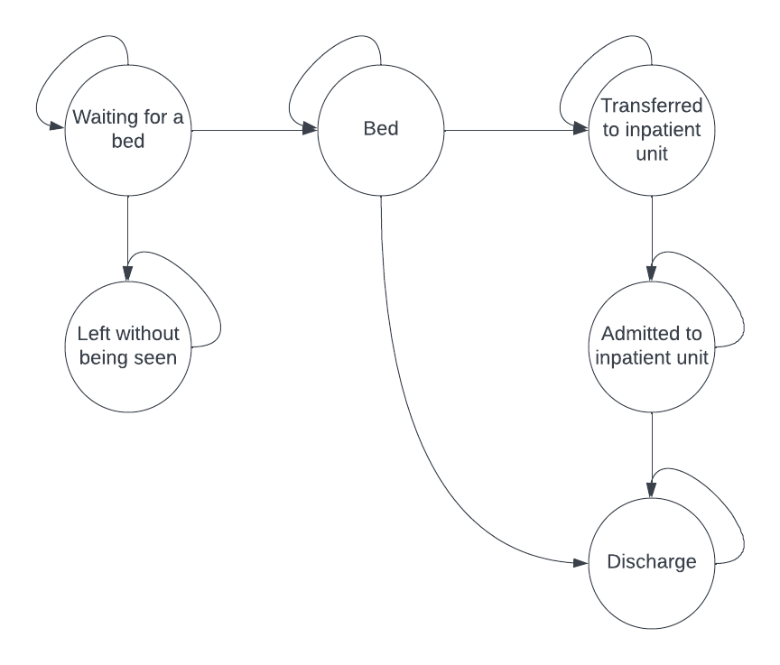

### Motivation (no more than 100 words)

Overcrowding in Emergency Department can result in long wait times for patients, decreased quality of care, and increased risk of adverse events. By understanding the factors that contribute to wait times and delays in moving patients from the ED to inpatient units, interventions can be implemented to improve patient outcomes and hosptial operations. 

### Statement of the question (single statement) 

Using a Markov model of emergency department (ED) patient flow, the impact of interventions aimed at reducing crowding can be evaluated.

### Population (single statement)

The target population of this Markov model is all patients admitted to an ED for an acute health condition.

### Health states (bubble diagram)

{width="40%"}

### Cycle length (one or two sentences)

Because in the ED things can move fast, and bed space is also function of patient arrival rates, I think that the appropriate cycle length would be 5 minutes. 

### Interventions (list)

The baseline intervention represents the current approach to managing bed availability in the ED. This baseline serves as a comparison point for evaluating the effectiveness of other interventions. We want to run this model to test several competing interventions so we could evaluate the results of the models and then decide on which intervention is most effective in improving patient flow:

- Increased staffing levels: This intervention involves increasing the number of staff in the ED to provide more efficient and effective care. This may involve adding additional nurses, physicians, or other healthcare providers. This treatment will alter the transition probabilities between inpatient unit transfer and inpatient unit admission. 

- Rapid medical assessment unit: This intervention involves improving the triage process in the ED to ensure that patients are seen as quickly as possible. The intervention is a rapid medical assessment that takes place in the waiting room for patients who's conditions are not serious enough to be admitted to the inpatient unit and are likely to transition from bed to discharge. This intervention would create a new pathway between waiting for a bed and discharge.

### Main model parameters (list)

The main parameters needed in my Markov model are:

- The transition probabilities representing the likelihood of a patient moving from one health state to another. These probabilities may be estimated based on historic data from the ED, inpatient units, or other sources. The transition probabilities will vary based on the intervention being evaluated, as different interventions may impact the flow of patients through the system.

- The intervention properties include important characteristics of each intervention. These properties will impact the transition probabilities, as they may affect the likelihood of a patient moving from one health state to another.

- The arrival rate of patients in the ED with be a stochastic process with arrival rate $\lambda$. Every cycle, given $\lambda$, there will be some flow of patients to the waiting for a bed state of the model. The transition probability between waiting for a bed and getting a bed will be a function of waiting room capacity.

### Outcomes (list)

The metrics that can be projected using this model to compare the interventions could be:

- Average length of stay in emergency department for patients with varying acuity levels
- Average time to inpatient admission for patients requiring admission
- Average waiting time for emergency department beds for patients with varying acuity levels
- Average number of patients who leave the emergency department without being seen

These outcomes can be evaluated over a period of 1 week since each day has a different distribution of incoming patient we would want to make sure that the time period is long enough to get accurate estimates for length of stay.

