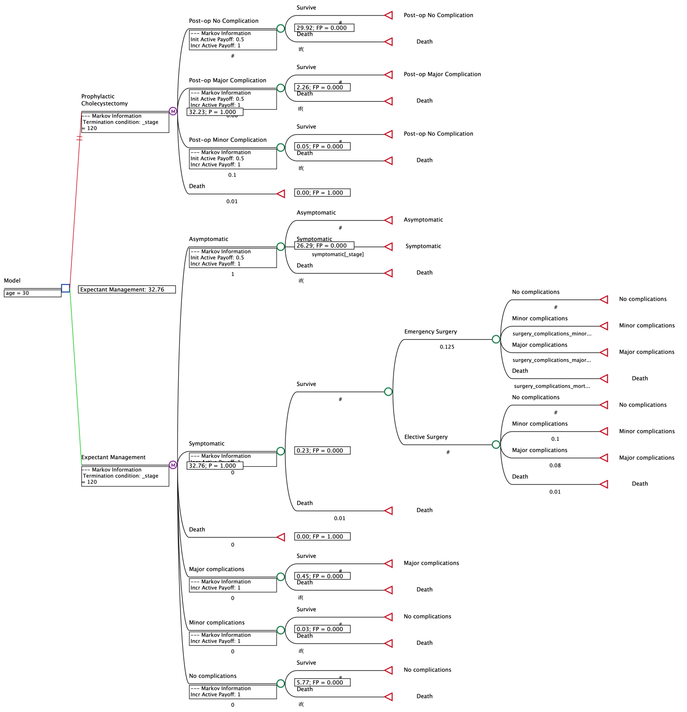
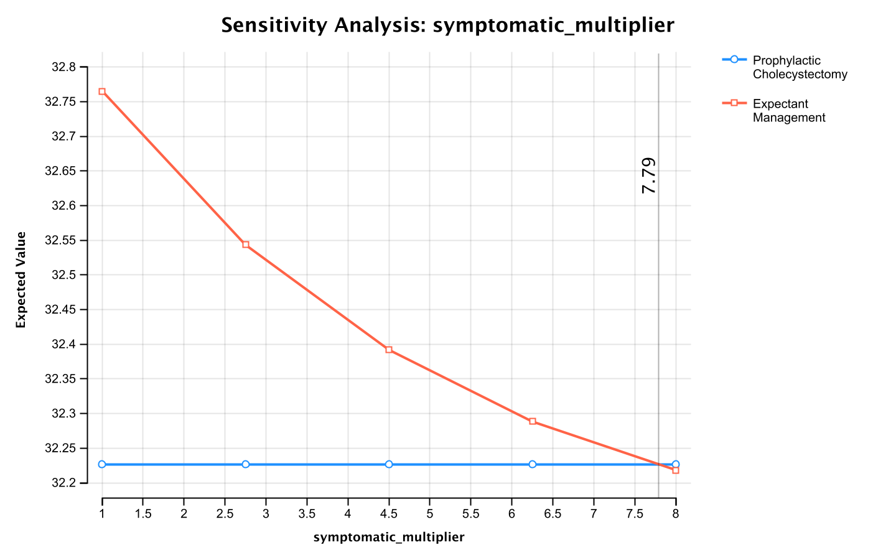
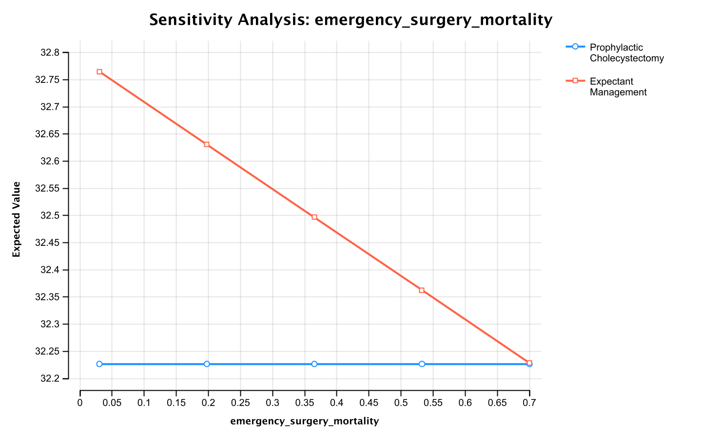

1. Construct this decision-analytic model in TreeAge (or another software package) using the information provided in the paper.

{width=70%}

\newpage

2. Calculate the life expectancy for each strategy for at least one of the age/gender groups. Note: for background mortality, use the 2018 US life tables. These are published by the National Center for Health Statistics:

- Go to https://www.cdc.gov/nchs/products/life_tables.html

- Click on the pdf link for the "United States Life Tables, 2020" (NVSR Volume 71,
Number 1)

- On pages 17 and 19 in this document (Tables 2 and 3, top of page) there are links to download 2020 life tables for men and women respectively.

- In these spreadsheets, the first column (qx) provides annual mortality probabilities.

\color{blue}
I calculated life expectancy for 30 year old males in both models. I got an estimate of 32.23 LE for the Prophylactic Cholecystectomy group, and 32.76 LE for the Expectant Management group.
\color{black}

3. Compare your results with those shown in Table 3 of the paper, and discuss potential
reasons for any discrepancies (besides the different life tables).

\color{blue}
Comparing my results with those shown in Table 3 of the paper, the authors get 29.96 LE for the Prophylactic Cholecystectomy group and 30.47 for the Expectant Management group. Though the decision is the same (Expectant Management is preferred to Prophylactic Cholecystectomy) and the difference is roughly the same as the authors, my numbers appear to be slightly larger than the authors. I believe the reason for this potential discrepancy is that average US life expectancy has increased since 1988, so because my life table uses 2018 life expectancy data this would cause the life expectancies in my model to be higher than that of the authors'. I also suspect that the authors had a slightly more sophisticated model than the one I am presenting here, for example they mention risks of developing galbladder cancer (which I do not factor in)
\color{black}

\newpage

4. Perform one-way sensitivity analysis on 2 of the key variables.

\color{blue}

I performed a one-way sensitivity analysis on a multiplier for the incidence in which asymptomatic turns to symptomatic. The incidence multiplier needs to be 7.79 before the preferred strategy switches. Because it is unlikely the incidence is that much higher that what is reported I think it is safe to say Expectant Management is a stable preferred choice under variation of this variable.

{width=70%}

I also performed a one-way sensitivity analysis on the mortality rate for emergency surgery. Again, just like the authors found, our decision is pretty stable under variation in this parameter (especially since it is unlikely emergency surgery would have a mortality rate of 70\%)

{width=70%}

