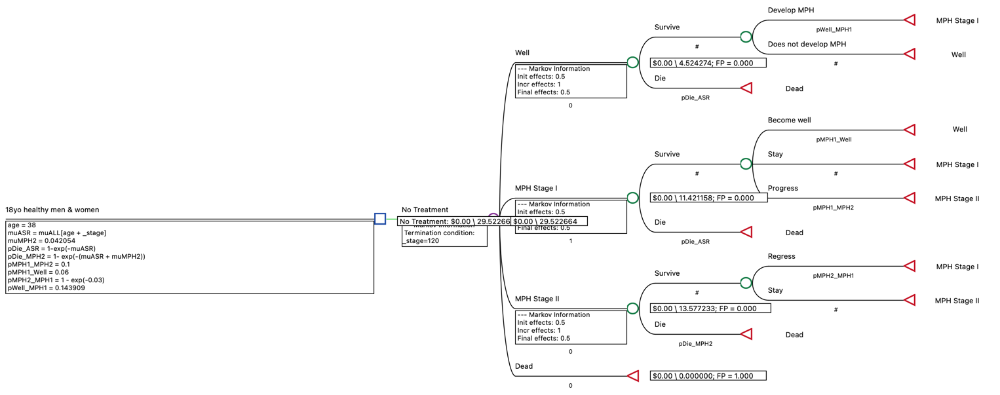

```{r, include=F, message=F}
library(kableExtra)
library(knitr)
```

### PART I. QUESTIONS [18 points]

#### CASE

You are part of a research team investigating the epidemic of "Markov Pain Horror" (MPH) in the United States. MPH is characterized by physical pain at different locations of the body depending on the patient's emotional status at the moment. MPH has two stages: a mild first stage (Stage I), and a severe second stage (Stage II).

Both stages of MPH are associated with reduced quality of life. Stage I MPH has a utility weight of 0.8 and Stage II MPH has a utility weight of 0.5. Individuals without MPH have a utility weight of 1.0.

In a cohort study of healthy 18-year-old men and women, the 9-month cumulative incidence of Stage I disease was 11%. There were no deaths in the study cohort over the 9-month follow-up period.

The annual probability of progression from Stage 1 to Stage II MPH is 0.1 among those who survive background mortality. Individuals with Stage II MPH regress to Stage I MPH at a hazard rate of 0.03 per person-year. Individuals with Stage I MPH can also become well again, but individuals with Stage II MPH cannot directly become well without passing through Stage I MPH first. The annual regression probability from Stage I MPH to Well has been estimated to be 0.06 for those who survive background mortality. Individuals who become well after having developed MPH face the same risk of developing MPH again as those who have never had MPH.

There is also excess mortality from Stage II MPH. An observational study that followed 25-year-old individuals with Stage II MPH found that one-year survival was 95.7783%.

1.  [3 points] The annual risk of developing Stage I MPH among those who are healthy is estimated to be 0.143909. This value is already entered into the TreeAge model. Describe step-by-step how this estimate was calculated, and state at least one assumption that is required for this calculation.

\color{blue}

I was unable to fully determine how this probability was solved. I will say that I believe the assumption that is required for this calculation is that we are able to extrapolate the 12 month cumulative incidence based on the 9 month cumulative incidence we are given. 


```{r}
yearly.ci <- 0.11*(12/9)
yearly.ci
```

We get 14.67% annual cumulative incidence. We also know background mortality and transition from well to stage I happens after surviving background mortality. We convert the hazard rate of death into a probability of death and then multiply the survival proportion by the 12 month cumulative incidence to the annual risk of developing Stage I MPH among those who are healthy.

```{r}
annual.mortality.18 <- 0.00058
annual.mortality.18.p <- 1 - exp(-0.00058)

(1 - annual.mortality.18.p)*yearly.ci
```

\color{black}

2.  [3 points] The excess mortality rate associated with Stage II MPH is estimated to be 0.042054. This value is already entered into the TreeAge model. Describe step-by-step how this estimate was calculated, and state at least one assumption that is required for this calculation.

\color{blue}

To calculate the excess mortality rate associated with Stage II MPH:

First note that an observational study that followed 25-year-old individuals with Stage II MPH found that one-year survival was 95.7783%. From the Life Table we also know the background mortality risk.

(i) First calculate the mortality rate of people with Stage II MPH. This is found by taking $r(t) = -\frac{ln(S(t))}{t}$. Since we are given the one-year survival probability of people with Stage II we can $r(1)$:

$$r(1) = -\frac{ln(0.957783)}{1}$$

```{r}
mu.D <- -log(0.957783)
mu.D
```

(ii) Now that we have the mortality rate, we can isolate the disease specific mortality rate by subtracting the difference between the mortality rate of people with Stage II MPH and the background mortality rate for a 25 year old in the Life Tables:

$$\mu_D = \mu_c - \mu_{ASR}$$

```{r}
mu.asr <- 0.00108
mu.D - 0.00108
```

Therefore the excess mortality rate associated with Stage II MPH is estimated to be 0.042054. Some assumptions required in this calculation are (1) that mortality rate is constant (required to use the DEALE method) and (2) excess mortality is additive.

\color{black}

3.  [12 points] There are six errors ("bugs") in the model (`exam2_tree_2023_bug.trex`) provided for a cohort of 18-year-old health individuals in the U.S. List all six of these bugs in your response to the question. Fix the bugs in the `.trex` file and submit the revised tree using the naming convention described on the checklist/cover page.

\color{blue}

solution

-   pDie_MPH2 is currently equal to $1 - exp(-muASR) - exp(-muMPH2)$ and this should be corrected to $1- exp(-(muASR + muMPH2))$.

-   Currently in MPH Stage II the probability of dying is derived from the the background mortality rate, not the MPH Stage II mortality rate. Therefore the probability of dying in MPH Stage II should be "`pDie_MPH2`" not "`pDie_ASR`".

-   Individuals with Stage II MPH regress to Stage I MPH at a hazard rate of 0.03 per person-year, not a probability like it is currently being treated as. Therefore we should change it such that $pMPH2\_MPH1 = 1 - exp(-0.03)$.

-   The terminal node in MPH Stage I for progression is bringing us back to Stage I and that needs to be a terminal node that goes to Stage II.

-   `mu_ASR` should be accounting for the individual getting older. It needs to be changed to `mu_ASR = mu_ALL[age + _stage]`

-   The termination condition of the model currently has it such that it terminates after 30 iterations. I am changing this so that the termination condition is `stage = 120`.

You can verify that I get the correct answer here and in my submitted `.trex` file:



\color{black}
