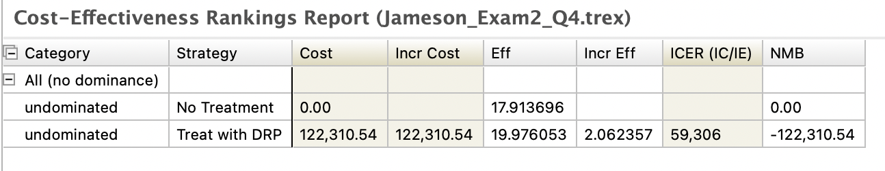
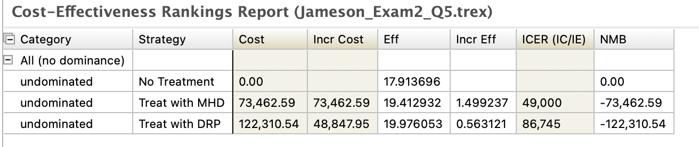
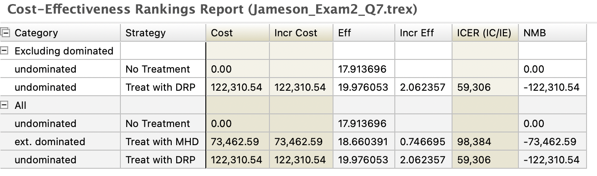
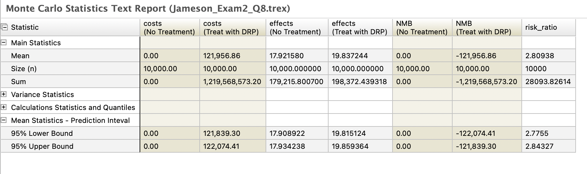
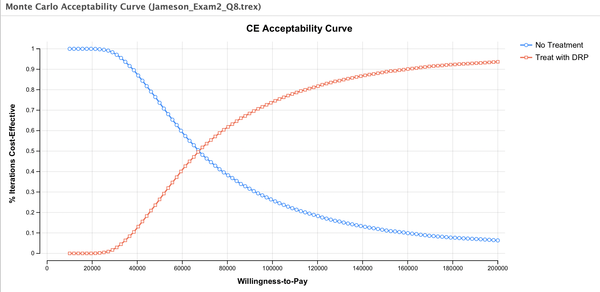

```{r, include=F, message=F}
library(kableExtra)
library(knitr)
```

### PART II. COST-EFFECTIVENESS OF TREATMENT [22 points]


The standard of care for MPH is to treat both stages of MPH with the “DRP” (Daily Relief Pill):

- DRP increases the probability of regression from Stage I to Well and the probability of regression from Stage II to Stage I.

  - One RCT studying the effect of DRP on Stage I patients reported that the hazard ratio for transitioning from Stage I to Well for patients taking DRP is 1.6, relative to untreated patients.
  
  - Another RCT studying the effect of DRP on Stage II patients reported that the risk ratio for transitioning from Stage II to Stage I for patients taking DRP is 2.8, relative to untreated patients.
  
- DRP costs $8,500 per year. You can assume that all treated patients are 100% adherent to the treatment.


4. [8 points] Off the blue decision node of the revised tree from Part I-3, modify the model and build the DRP treatment strategy described above, including costs and utilities. Name this strategy ‘Treat with DRP’. Assume that people get treated with DRP as soon as they have Stage I MPH and continue treatment as long as they have either Stage I or Stage II MPH. Assume that the cost for the ‘No Treatment’ strategy is zero and the discount rate is 2.5% per year for both costs and benefits. Save and submit this tree using the naming convention described on the checklist/cover page.


\color{blue}

In order to make sense of the hazard ratio, I needed to first calculate the hazard rate for transitioning from Stage I to Well for untreated patients. The probability of transitioning from Stage I to Well is 0.06, so:


\[\text{Hazard Rate}_1 = -ln(1 - 0.06)\]


```{r}
-log(1-0.06)
```

Therefore the hazard rate of transitioning from Stage I to Well for untreated patients is 0.0618754. 

We know that that the hazard ratio is 1.6, meaning:

\[\frac{\text{Hazard Rate}_2}{\text{Hazard Rate}_1} = 1.6\]

Where Hazard Rate$_2$ is the hazard rate for transitioning from Stage I to Well for patients taking DRP. Therefore to solve for the probability of transitioning from Stage I to Well for treated patients we solve the following:

\[-ln(1 - p_2) = 1.6*(0.0618754)\]

\[p_2 = 1 - exp(-1.6*(0.0618754)) \]

```{r}
1 - exp(-1.6*(0.0618754))
```

This is the probability that I use in my model to represent the updated probability of transitioning from Stage I to Well for patients taking DRP. The model was submitted to Canvas with the proper naming convention. 


\color{black}


5. [3 points] Starting with an initially healthy cohort of 25-year-old men and women, what is the incremental cost-effectiveness ratio associated with the standard-of-care treatment with DRP, as compared to no treatment? Given a willingness-to-pay (WTP) threshold of \$50,000 per quality-adjusted life year (QALY), is treatment with DRP cost-effective? Is DRP cost-effective at a WTP threshold of \$100,000 per QALY?


\color{blue}

When I do this analysis, I find that the incremental cost-effectiveness ratio associated with the standard-of-care treatment with DRP, as compared to no treatment, is $59,306 per QALY.




This means given a willingness-to-pay (WTP) threshold of \$50,000 per quality-adjusted life year (QALY), treatment with DRP is **not** cost-effective. However, DRP is cost-effective at a WTP threshold of \$100,000 per QALY.

\color{black}


Scientists have discovered a new treatment for MPH (both stages), called “Markov Happy Days” (MHD). MHD reduces the severity of symptoms from MPH and therefore increases the utility for Stage I MPH to 0.9 and the utility for Stage II MPH to 0.6. Unlike DRP, it does not have an impact on regression from Stage II to Stage I nor from Stage I to Well. MHD therapy costs $4,900 per year. As with DRP treatment, patients treated with MHD receive the drug only when they are in Stage I or Stage II disease and discontinue the drug if they return to the Well state. Due to drug-drug interaction, patients cannot be given both MHD and DRP.


6. [4 points] For an initially healthy cohort of 25-year-old men and women, conduct a cost- effectiveness analysis evaluating the three treatment strategies: (1) No Treatment, (2) Treat with DRP, (3) Treat with MHD. Given a willingness-to-pay (WTP) threshold of \$50,000 per quality-adjusted life year (QALY), what is the optimal treatment strategy? How about a WTP threshold of \$100,000 per QALY? Justify your choice. Save and submit this tree using the naming convention described on the checklist/cover page.


\color{blue}

When I conduct a cost-effectiveness analysis evaluating the three treatment strategies, I find that the incremental cost-effectiveness ratio associated with the treatment with MHD, as compared to no treatment, is \$49,00 per QALY. 





Given a willingness-to-pay (WTP) threshold of \$50,000 per quality-adjusted life year (QALY), the optimal treatment strategy is to treat with MHD. With a WTP threshold of \$100,000 per QALY, however, we should choose to treat with DRP because the ICER suggests that it is still below our WTP threshold and even though its more expensive than MHD, it generates a larger health gain. 


\color{black}


7. [3 points] A new RCT of the MHD therapy revealed that the effect of the therapy on the utility for Stage II MPH is not constant by age. For those treated with MHD, the utility weight for Stage II MPH remains constant at 0.6 when the Stage II MPH patient is between 18 and 30 years of age (inclusive), but then decreases by an absolute 0.005 per year starting from age 31 until death. You should assume that the treatment strategy for MHD stays the same (i.e. everyone in Stage I and Stage II disease receives MDH treatment, regardless of age). You can assume that the utility weight for Stage I MPH with MHD remains constant over time (0.9).


Update your cost-effectiveness analysis in Question 6 with this new piece of evidence. Report your CEA results and the optimal strategy under the two WTP thresholds ($50,000/QALY & $100,000/QALY). Save and submit this tree using the naming convention described on the checklist/cover page.


\color{blue}

Updating my cost-effectiveness analysis in Question 6 with this new piece of evidence, I see that according to my CEA results:





Given a willingness-to-pay (WTP) threshold of \$50,000 per quality-adjusted life year (QALY), the optimal treatment strategy is to not treat. This is because neither of our two treatment strategies are below our WTP threshold.

With a WTP threshold of \$100,000 per QALY we should treat with MDH because it dominates treating with DRP and has an ICER of $59,306 per QALY, which is below our WTP.


\color{black}


8. [4 points] There is uncertainty about the effect of DRP on the risk ratio for regressing from Stage II to Stage I, since our point estimate is derived from one RCT. Using the completed tree from Part 2 Question 5, perform a 2nd-order Monte Carlo simulation (probabilistic sensitivity analysis) using 10,000 parameter sets to understand the implications of this uncertainty for the choice between the No Treatment strategy and the DRP Treatment strategy, for the cohort of healthy 25-year-olds. To do so, specify a LogNormal distribution for the risk ratio associated with DRP treatment, with a mean of 2.8 and median of 2.4. Save and submit this tree using the naming convention described on the checklist/cover page.


Report the 95% uncertainty intervals for discounted costs and discounted quality-adjusted life expectancy for the DRP treatment strategy. Please round your answer to two digits after the decimal.


Provide a Cost-Effectiveness Acceptability Curve (CEAC) for the WTP ranging from $10,000 to $200,000 per QALY saved (set the WTP Intervals option to 100) and interpret the CEAC to describe the decision uncertainty.


\color{blue}

After performing a 2nd-order Monte Carlo simulation, I found the 95% uncertainty intervals for discounted costs to be (121,905.27, 122,140.68) and discounted quality-adjusted life expectancy for the DRP treatment strategy to be (19.801, 19.844).




My CEAC plot is below:




This chart shows the fraction of all simulations in which a given strategy is optimal, for a particular CE threshold (horizontal axis). As we can see, at a WTP threshold of ~$67,000, the simulation is predicting an equal likelihood of the treatment and non-treatment being cost-effective. After this WTP threshold we see that the probability that the treatment is cost-effective is greater than the probability that it is not.


