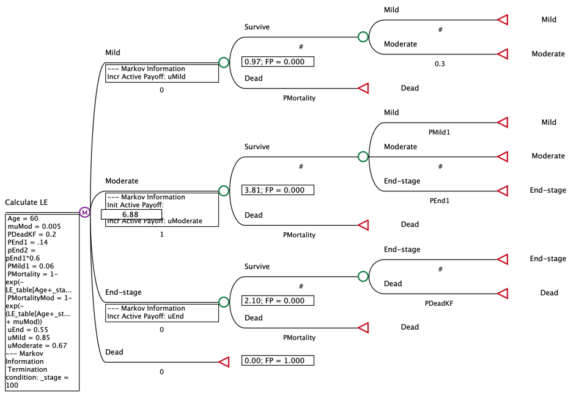
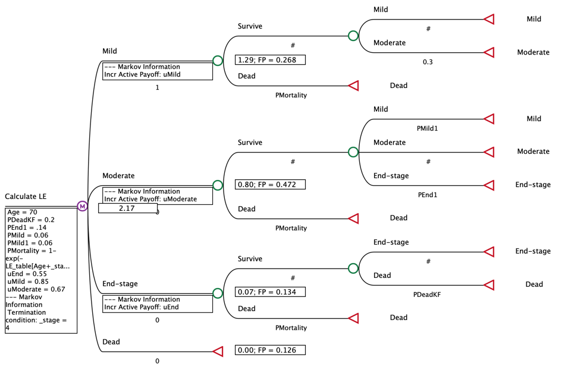
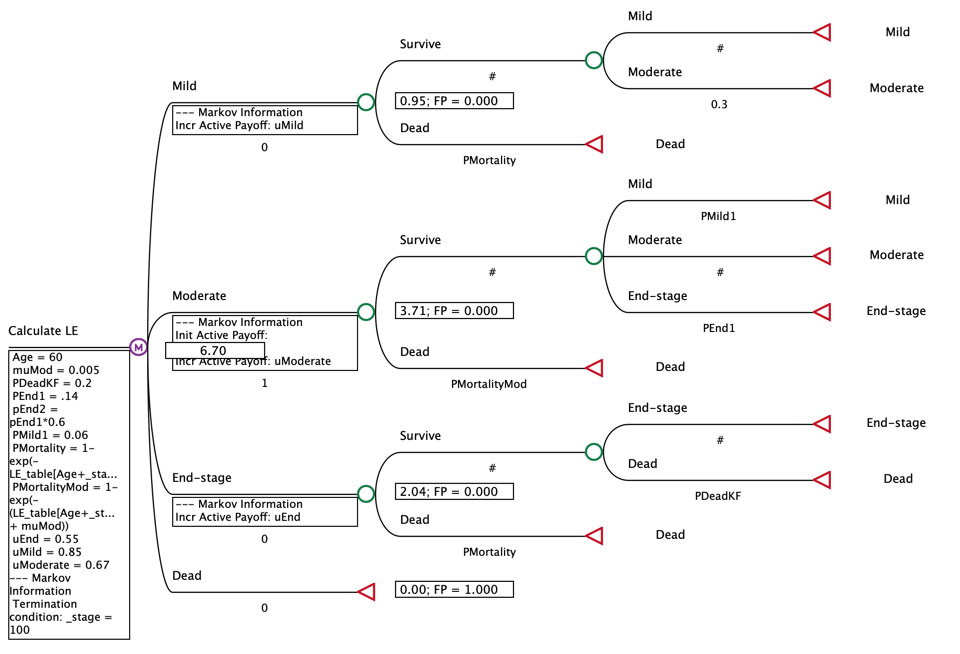
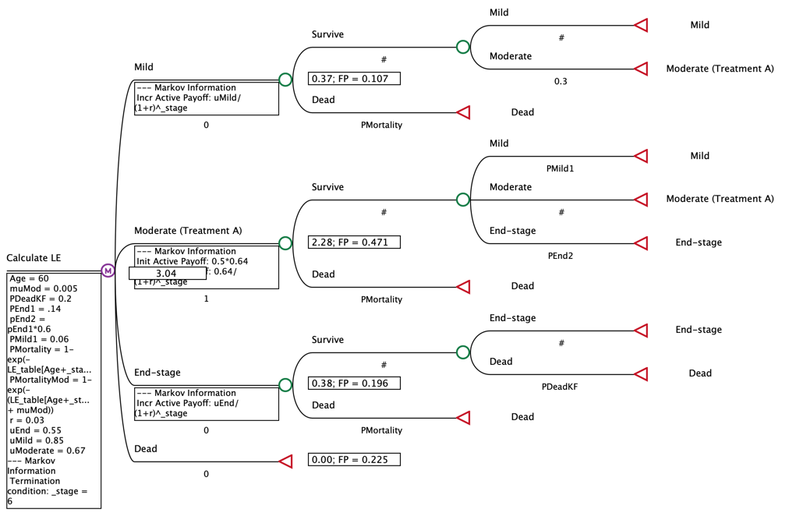
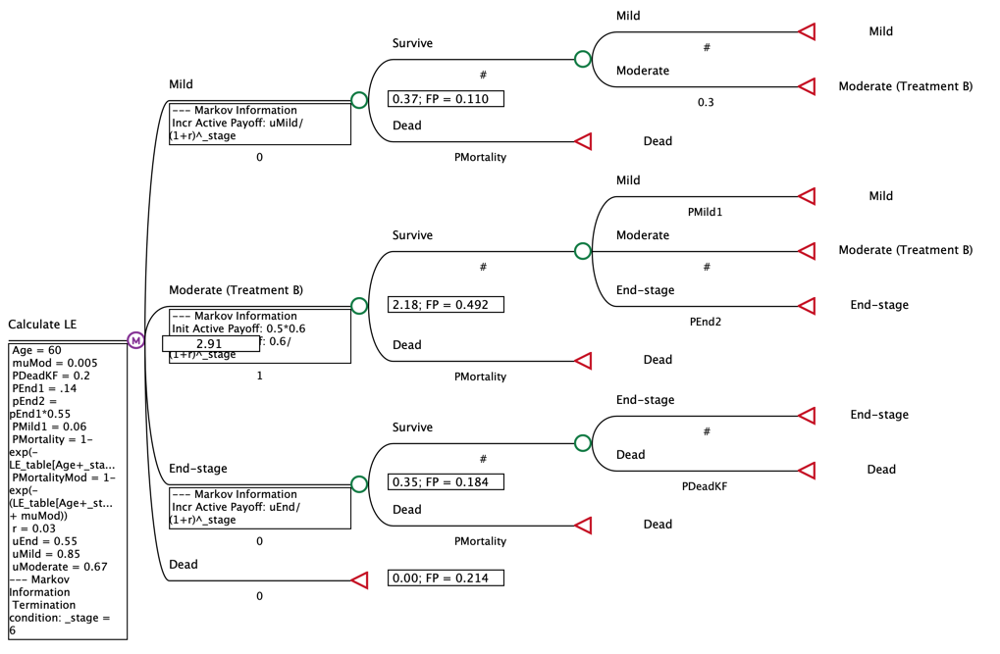

### Question 3 

Patients with chronic kidney disease (CKD) experience gradual loss of kidney function over time. As the disease worsens, the extent of kidney damage results in complications such as difficulty urinating, high blood pressure, anemia, malnutrition, nerve damage, and decreased mental sharpness. In End-stage CKD, patients experience kidney failure and face high mortality rates. Therefore, CKD can impact both survival and quality of life.

For a hypothetical cohort of 60-year-old U.S. men with CKD, the stages of CKD are categorized into three health states: Mild, Moderate, and End-stage (Note: CKD is usually classified into five stages, but we have simplified it for this question). We assume that patients can never return to a state of perfect health once they have developed CKD.

All patients in this hypothetical cohort begin with a new diagnosis of CKD in the Moderate state which has a utility weight of 0.67. Each year, conditional on surviving background mortality, patients in the Moderate state receive standard of care and have a 14% probability of progressing to the End-stage state and an 6% probability of regressing back to the Mild state. For patients in the Mild state, if they survive background mortality, 30% of them can progress to the Moderate state under standard of care.

Individuals in the Mild state have a utility of 0.85. For patients in the End-stage state, if they survive background mortality, they have a 20% probability of dying directly from kidney failure and they cannot regress to other disease states.

Individuals in the End-stage state have a utility of 0.55. Individuals in Mild and Moderate states are assumed to experience no CKD-specific mortality unless they progress to the End-stage state.

For this question, use an annual cycle length and apply a termination criterion of 100 cycles. Apply the half-cycle correction for all calculations. You are given the 2012 U.S. life tables to inform the values of age-specific background mortality rates.

\newpage

a) [5 points] Estimate the (undiscounted) quality-adjusted life expectancy (QALE) for a cohort of 60-year-old U.S. men who have been diagnosed with Moderate state CKD.

\color{red}

Based on my model, my estimate of the (undiscounted) quality-adjusted life expectancy (QALE) for a cohort of 60-year-old U.S. men who have been diagnosed with Moderate state CKD is 6.88 QALE.

\color{black}

\newpage

b) [2 points] What is the probability that a U.S. man who is in the Mild state at 70 years old will be in that state four years later? The individual may transition between model states during this time.

\color{red}

The probability that a U.S. man who is in the Mild state at 70 years old will be in that state four years later is 26.8\%.

\color{black}

\newpage

c) [3 points] New evidence suggests that individuals in the Moderate state face an excess mortality of 0.005 deaths per person-year. The probability of progression to the End- stage state remains at 14% and the probability of regression to the Mild state remains at 6% (conditional on surviving background and CKD-specific mortality). Under this assumption, what is the undiscounted QALE for a cohort of 60-year-old U.S. men who have just been diagnosed in Moderate state CKD?

\color{red}

Under this assumption, the undiscounted QALE for a cohort of 60-year-old U.S. men who have just been diagnosed in Moderate state CKD is 6.7 QALE. This makes sense that it would be slightly less than the QALE value calculated in (a) since Moderate state individuals now face an additional mortality risk.

\color{black}

\newpage

**For the following sections, use the model you developed for parts a)-b).Do not use the assumption from part c).**

d) [5 points] Estimate the discounted quality-adjusted life expectancy for a cohort with a new diagnosis of Moderate CKD who receive Treatment A. Estimate the discounted QALE for a cohort with a new diagnosis of Moderate CKD who receive Treatment B. Apply an annual discount rate of 3\%.

\color{red}
{width=70%}

{width=70%}

The discounted quality-adjusted life expectancy for a cohort with a new diagnosis of Moderate CKD who receive Treatment A is 6.59 QALE. The discounted QALE for a cohort with a new diagnosis of Moderate CKD who receive Treatment B is 6.50 QALE. Therefore, there is a larger QALE gain associated with treatment A compared to treatment B.

\color{black}

\newpage

e) [3 points] What is the probability that a patient with a new diagnosis of Moderate CKD will be in the End-stage state after six years if given Treatment A? Treatment B?

\color{red}

{width=70%}

{width=70%}

The probability that a patient with a new diagnosis of Moderate CKD will be in the End-stage state after six years if given Treatment A is 19.6\%. The probability that a patient with a new diagnosis of Moderate CKD will be in the End-stage state after six years if given Treatment B is 18.4\%. 

\color{black}

\newpage

f) [2 points] You did a literature review and found that a few more RCTs in recent years have compared Treatment B to standard of care. However, these studies reported different values for the risk ratio of progression from Moderate CKD to the End-stage state with Treatment B. Given the uncertainty about the correct value for this risk ratio, what is the risk ratio at which the discounted QALE for someone treated with Treatment B would be the same as the QALE for someone treated with Treatment A?

\color{red}

Conducting a one-way sensitivty analysis on the value for the risk ratio of progression from Moderate CKD to the End-stage state with Treatment B, I find that the risk ratio at which the discounted QALE for someone treated with Treatment B would be the same as the QALE for someone treated with Treatment A is at $~0.53$.

{width=70%}

\begin{table}[h]
\centering
\begin{tabular}{|l|l|l|l|l|l|}
\hline
Attribute & Variable Name & Variable Value & Comparator & Baseline & Value \\ \hline
EV & Risk Ratio & 0.528062779 & Treatment B & Treatment A & 6.58748505 \\ \hline
\end{tabular}
\end{table}

\color{black}

\newpage

BONUS QUESTION [2 points]

A study reports a risk ratio of developing disease that is relevant for your modelling analysis. This risk ratio describes incidence for individuals with a certain risk factor to those without it. However, the study was conducted in a setting with extremely high incidence rates. What concerns might you have about using this risk ratio estimate for your analysis, which models outcomes in a lower incidence population? Describe your concerns, as well as the direction of any bias that might be introduced by using this value directly in your study.

\color{red}

If the study was conducted in a setting with extremely high incidence rates, I would be concerned about the generalizability of the risk ratio when analyzing the lower incidence population. For instance it may be true that the risk factor driving the incidence is proportionately higher in the high incidence population. This would make it so the risk ratio is not helpful in analyzing the population with the lower incidence. If this is the case, I would expect that the risk ratio may lead me to overestimate the risk of developing the disease in the lower incidence population, since they are missing they do not have the same risk factor driving disease development in the high incidence population

\color{black}

